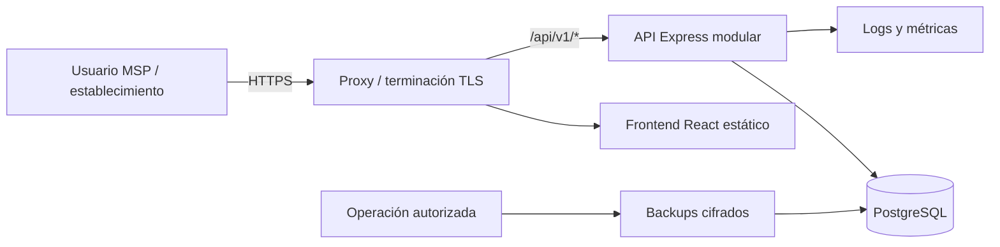
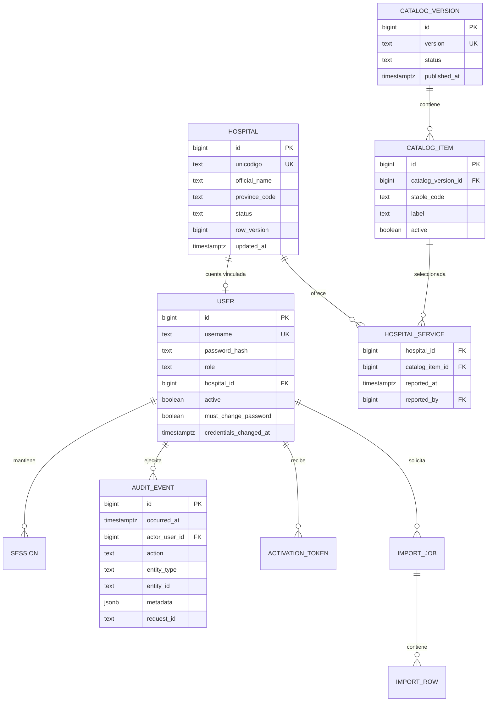
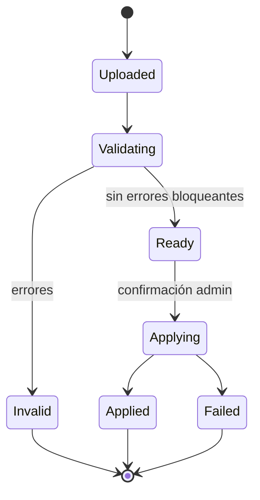

# FASE 3 — Diseño arquitectónico de SIGCAS-MSP v0.4

**Estado:** propuesta base para revisión técnica y funcional<br>
**Fecha:** 22 de septiembre de 2026<br>
**Alcance:** arquitectura objetivo de v0.4; no constituye autorización de despliegue ni corrige por sí sola los bloqueadores P0 identificados en el diagnóstico.

## 1. Propósito y principios

SIGCAS-MSP v0.4 consolidará establecimientos, su cartera de prestaciones y la administración de accesos en una aplicación institucional auditable. El diseño prioriza:

1. **Seguridad por defecto:** ningún secreto o permiso implícito; denegar ante configuración inválida.
2. **Una sola fuente de verdad:** PostgreSQL para datos operativos y catálogos; no duplicar semillas en el navegador.
3. **Autorización en servidor:** la interfaz ayuda al usuario, pero nunca define la frontera de seguridad.
4. **Cambios trazables:** migraciones, auditoría, contratos y artefactos versionados.
5. **Consistencia antes que distribución:** monolito modular mientras el volumen no justifique servicios independientes.
6. **Portabilidad:** mismo artefacto para desarrollo, pruebas, piloto y producción.
7. **Datos mínimos:** recolectar, exportar y retener solo lo aprobado por el MSP.

## 2. Alcance funcional de v0.4

### Incluido

- autenticación, cierre de sesión, cambio y restablecimiento administrativo de contraseña;
- activación segura y cambio obligatorio de contraseña inicial;
- administración de usuarios con roles explícitos;
- consulta y mantenimiento autorizado de establecimientos;
- gestión de la cartera de prestaciones por establecimiento;
- importación validada y exportación controlada;
- catálogo institucional versionado;
- auditoría consultable con filtros y paginación;
- healthchecks, logs estructurados, métricas básicas y operación de backup/restore.

### Fuera de alcance salvo aprobación posterior

- microservicios, Kubernetes y un bus de eventos externo;
- interoperabilidad clínica o almacenamiento de historias clínicas;
- firma electrónica, facturación o agenda asistencial;
- autoservicio público de registro;
- analítica avanzada o data warehouse;
- recuperación de contraseña por correo hasta disponer de proveedor y política institucional.

## 3. Decisión arquitectónica principal

Se adopta un **monolito modular** con frontend SPA, API HTTP y PostgreSQL:



No se separan servicios en v0.4 porque los módulos comparten transacciones, el equipo mantiene una única aplicación y no existe evidencia de escalado independiente. Los límites de módulo se conservarán para permitir una extracción futura sin introducir complejidad distribuida prematura.

## 4. Contenedores y responsabilidades

| Contenedor | Responsabilidad | No debe hacer |
|---|---|---|
| Navegador | Presentación, accesibilidad, validación de conveniencia y consumo del API | Autorizar, custodiar secretos o contener datos maestros embebidos |
| Proxy web | TLS, cabeceras, estáticos, compresión y enrutamiento `/api` | Aplicar reglas de negocio |
| API | Autenticación, autorización, validación, casos de uso, auditoría y persistencia | Servir dos implementaciones divergentes o ejecutar DDL no versionado al iniciar |
| PostgreSQL | Integridad, relaciones, sesiones, datos maestros y operativos | Exponerse directamente a Internet |
| Ejecutor de migraciones | Aplicar una versión de esquema antes de promover la aplicación | Ejecutarse concurrentemente desde cada réplica |
| Operación de backup | Crear, cifrar, retener y probar restauraciones | Compartir credenciales con la aplicación si puede evitarse |

## 5. Diseño del backend

### 5.1 Capas

```text
backend/src/
├── app/                 # composición Express, middlewares y rutas
├── config/              # lectura y validación fail-fast del entorno
├── modules/
│   ├── auth/            # sesión, credenciales y activación
│   ├── users/           # usuarios, roles, estado y vínculos
│   ├── hospitals/       # establecimiento y perfil editable
│   ├── catalog/         # catálogo y versiones
│   ├── portfolios/      # prestaciones por establecimiento
│   ├── imports/         # validación, staging y aplicación
│   └── audit/           # eventos y consulta autorizada
├── shared/
│   ├── db/              # pool, transacciones y repositorios comunes
│   ├── http/            # errores, paginación y request ID
│   ├── security/        # autorización, CSRF y rate limit
│   └── validation/      # esquemas de entrada/salida
└── server.js            # única entrada de proceso
```

Flujo obligatorio de una petición:

```text
HTTP → request-id → seguridad HTTP → sesión → autorización → validación
     → caso de uso → transacción/repositorio → auditoría → respuesta
```

Las rutas no contienen SQL ni reglas de negocio. Los repositorios no conocen objetos HTTP. Los casos de uso reciben un actor autenticado y ejecutan autorización contextual antes de modificar datos.

### 5.2 Módulos y dependencias permitidas

| Módulo | Propietario de | Puede depender de |
|---|---|---|
| `auth` | sesiones, credenciales, activaciones | `users`, seguridad compartida |
| `users` | identidad, rol, estado, vínculo hospitalario | acceso DB y auditoría |
| `hospitals` | datos maestros y perfil del establecimiento | `portfolios`, auditoría |
| `catalog` | prestaciones y versiones publicadas | auditoría |
| `portfolios` | selección hospital–prestación | `hospitals`, `catalog`, auditoría |
| `imports` | archivo, staging, errores y aplicación | `hospitals`, `catalog`, auditoría |
| `audit` | eventos inmutables y consulta | acceso DB |

Se prohíben dependencias circulares. La comunicación entre módulos ocurre mediante casos de uso públicos, no accediendo a tablas ajenas desde controladores.

### 5.3 Transacciones

- Alta/edición de establecimiento y reemplazo de cartera: una transacción.
- Cambio de credencial y revocación de sesiones: una transacción.
- Aplicación de importación: transacción por lote acordado; el staging permanece para diagnóstico.
- Evento de auditoría crítico: se inserta en la misma transacción que el cambio.
- Consultas no requieren transacción explícita salvo consistencia de varias lecturas.

## 6. Modelo de dominio y datos

### 6.1 Entidades objetivo



### 6.2 Reglas de modelado

- Usar ID interno inmutable; `unicodigo` es clave de negocio única, no contraseña ni ID relacional.
- Referenciar catálogo por `stable_code`/ID, nunca por la etiqueta visible.
- Separar **datos maestros** de **perfil reportado** si el MSP confirma propietarios distintos; hasta entonces, imponer listas de campos por rol.
- Guardar fechas como `TIMESTAMPTZ`; evitar fechas operativas en texto.
- Incorporar `row_version` para detectar ediciones concurrentes mediante control optimista.
- Mantener restricciones `NOT NULL`, `CHECK`, `UNIQUE` y claves foráneas como última barrera de integridad.
- No almacenar contraseñas temporales, tokens de activación o secretos en texto: persistir únicamente hashes y expiración.

### 6.3 Migraciones y semillas

1. Las migraciones son archivos numerados, inmutables y versionados.
2. El despliegue ejecuta una tarea única de migración antes de promover la aplicación.
3. La API verifica compatibilidad del esquema, pero no crea ni altera tablas al iniciar.
4. Las semillas son idempotentes, tienen versión y se separan de las migraciones estructurales.
5. Catálogos publicados no se reescriben: se crea una nueva versión y se define una transición explícita.
6. Toda migración destructiva requiere backup verificado y procedimiento de reversión o avance correctivo.

## 7. Contrato HTTP v1

### 7.1 Convenciones

- Base: `/api/v1`.
- JSON UTF-8; fechas ISO 8601 UTC.
- Sesión en cookie `HttpOnly`, `Secure` en producción y `SameSite` definido por topología.
- Mutaciones protegidas contra CSRF si se usa autenticación por cookie.
- Paginación: `page[cursor]` y `page[size]`, con límite máximo del servidor.
- Filtros explícitos; ordenamiento mediante campos permitidos.
- Concurrencia: `ETag`/`If-Match` o `rowVersion` para actualizaciones.
- Toda respuesta incluye `X-Request-Id`; los errores no exponen stack ni SQL.

Formato de error:

```json
{
  "error": {
    "code": "VALIDATION_ERROR",
    "message": "La solicitud contiene datos inválidos.",
    "fields": [{ "path": "email", "code": "INVALID_FORMAT" }],
    "requestId": "01K..."
  }
}
```

### 7.2 Recursos principales

| Método y ruta | Permiso | Propósito |
|---|---|---|
| `POST /auth/login` | Público limitado | Crear sesión; regenerar ID después de autenticar |
| `POST /auth/logout` | Autenticado | Destruir sesión actual |
| `GET /auth/me` | Autenticado | Obtener actor y permisos efectivos |
| `POST /auth/change-password` | Autenticado | Cambiar contraseña y revocar otras sesiones |
| `POST /activations/:token/complete` | Token de un uso | Definir credencial inicial |
| `GET /hospitals` | Admin; hospital limitado | Consulta paginada y filtrada |
| `POST /hospitals` | Admin | Crear establecimiento |
| `GET /hospitals/:id` | Admin o propietario | Obtener detalle permitido |
| `PATCH /hospitals/:id/master-data` | Admin | Modificar campos maestros |
| `PATCH /hospitals/:id/profile` | Admin o propietario | Modificar solo campos reportables |
| `PUT /hospitals/:id/portfolio` | Admin o propietario | Reemplazar cartera de forma atómica |
| `GET /catalog/versions/current/items` | Autenticado | Consultar catálogo publicado |
| `GET /users` | Admin | Consulta paginada |
| `POST /users` | Admin | Crear cuenta/invitación segura |
| `PATCH /users/:id/status` | Admin | Activar o desactivar |
| `POST /imports` | Admin | Crear importación en staging |
| `GET /imports/:id` | Admin | Resultado y errores por fila |
| `POST /imports/:id/apply` | Admin | Aplicar importación validada |
| `GET /audit-events` | Admin autorizado | Consulta filtrada y paginada |
| `GET /health/live` | Plataforma | Estado del proceso, sin dependencias |
| `GET /health/ready` | Plataforma | Compatibilidad de DB y disponibilidad |

La especificación OpenAPI será fuente contractual y deberá validarse en CI. No se mantienen rutas nuevas en `/api` sin versión.

## 8. Autorización y propiedad de campos

### 8.1 Matriz base

| Acción | Admin | Hospital | Anónimo |
|---|:---:|:---:|:---:|
| Consultar todos los establecimientos | Sí | No | No |
| Consultar establecimiento propio | Sí | Sí | No |
| Cambiar datos maestros | Sí | No | No |
| Cambiar perfil reportable propio | Sí | Sí | No |
| Cambiar cartera propia | Sí | Sí | No |
| Administrar usuarios/importaciones | Sí | No | No |
| Consultar auditoría | Sí, con permiso | No | No |

### 8.2 Campos

- **Maestros:** unicódigo, nombre oficial, institución, red, nivel, tipología y división territorial oficial.
- **Reportables:** dirección operativa, contacto, teléfono, correo, horario, camas, cartera y observaciones.
- El servidor descarta o rechaza campos fuera de la lista del caso de uso; nunca se pasa `req.body` directamente al repositorio.
- Un hospital se resuelve desde la sesión (`hospital_id`), no desde un identificador suministrado por el cliente para decidir pertenencia.

## 9. Seguridad

### Identidad y sesión

- Contraseñas iniciales aleatorias o enlace de activación de un uso; nunca el unicódigo.
- Longitud mínima y política institucional; hash con algoritmo/costo revisable.
- Regenerar sesión al autenticar y al elevar privilegios.
- Revocar sesiones al cambiar contraseña, desactivar usuario o detectar incidente.
- Límite de intentos por combinación de usuario/IP con respuesta no enumerativa.
- Preparar MFA para administradores, condicionado a decisión institucional.

### Aplicación y plataforma

- Validación fail-fast de variables; prohibidos secretos predeterminados.
- CSP sin `unsafe-inline` como objetivo; scripts y estilos servidos localmente.
- HTTPS obligatorio, HSTS en el borde y cookies seguras.
- Protección CSRF, límites de cuerpo/ruta y timeouts.
- Consultas parametrizadas y cuentas DB con mínimo privilegio.
- Imágenes no-root, dependencias bloqueadas y análisis de vulnerabilidades/secretos en CI.
- Exportaciones registradas, autorizadas y protegidas contra fórmulas de hoja de cálculo.

## 10. Importación masiva

La importación se diseña como flujo de dos pasos:



1. El servidor recibe archivo con límites de tamaño y tipo.
2. Un parser RFC 4180 procesa comillas, comas, BOM y saltos válidos.
3. Cada fila se normaliza y valida contra catálogos y unicódigos.
4. Se guarda staging con resumen y errores; ningún dato operativo cambia todavía.
5. Un administrador confirma la aplicación.
6. La transacción aplica el lote y registra auditoría, conteos y hash del archivo.
7. El archivo original se elimina según la retención aprobada.

Para el volumen actual puede procesarse dentro de la API con límites estrictos. Si el tiempo supera el timeout acordado, el módulo se moverá a un worker del mismo código desplegable, sin alterar el dominio.

## 11. Frontend

```text
frontend/src/
├── app/                 # router, providers y error boundary
├── api/                 # cliente generado/tipado desde OpenAPI
├── auth/                # sesión y guards de navegación (solo UX)
├── features/
│   ├── hospitals/
│   ├── portfolio/
│   ├── users/
│   ├── imports/
│   └── audit/
├── components/          # componentes accesibles compartidos
└── styles/              # tokens y estilos locales
```

- Retirar semillas, credenciales históricas y `window.storage` del bundle.
- Cargar rutas administrativas y gráficos de forma diferida.
- No almacenar datos sensibles ni sesión en `localStorage`.
- Centralizar estados de carga, errores y reintentos seguros.
- Confirmar operaciones destructivas y bloquear doble envío.
- Cumplir navegación por teclado, foco visible, etiquetas y tablas adaptables.
- Alojar localmente las tipografías aprobadas o usar fuentes del sistema.

## 12. Despliegue objetivo

### Topología inicial

- Una imagen inmutable construida desde lockfiles.
- Proxy/plataforma termina TLS y enruta al proceso web.
- API y frontend pueden permanecer en una imagen para Railway; Compose puede separarlos, pero ambos usan el mismo código de servidor.
- PostgreSQL administrado o dedicado, sin puerto público.
- Migración como paso de release, antes del cambio de tráfico.
- Secretos inyectados por plataforma, nunca incluidos en imagen o repositorio.

### Secuencia de release

1. CI valida formato, pruebas, OpenAPI, migraciones, dependencias y secretos.
2. CI construye imagen por digest y genera inventario/SBOM.
3. Backup previo cuando la migración lo requiera.
4. Job único aplica migraciones.
5. Se despliega el mismo digest y se espera `ready`.
6. Se ejecuta smoke test autenticado con cuenta técnica limitada.
7. Se promueve tráfico o se revierte aplicación; la estrategia DB queda definida por migración.

## 13. Observabilidad y operación

- Logs JSON con timestamp, nivel, servicio, versión, ambiente, request ID y actor pseudonimizado.
- Nunca registrar contraseñas, cookies, tokens, cuerpos completos de importación ni datos personales innecesarios.
- Métricas: latencia/error por ruta, pool DB, sesiones, logins fallidos, importaciones y uso de recursos.
- Alertas iniciales: falta de disponibilidad, errores 5xx, agotamiento DB, fallos de backup y picos de autenticación.
- `/health/live` solo confirma proceso; `/health/ready` verifica DB y versión de esquema con timeout corto.
- Definir RPO/RTO, retención, cifrado y prueba periódica de restauración antes del piloto.

## 14. Objetivos no funcionales propuestos

Los valores deben ratificarse con MSP antes del piloto:

| Atributo | Objetivo inicial |
|---|---|
| Disponibilidad | 99,5 % mensual durante ventana acordada |
| Rendimiento | p95 < 500 ms en consultas comunes, excluyendo importaciones |
| Capacidad | 100 usuarios concurrentes y 10 000 establecimientos como prueba base |
| Importación | Hasta 10 000 filas/archivo, con límites revisables por prueba |
| Seguridad | Cero secretos predeterminados; cobertura de autorización por endpoint/rol |
| Recuperación | RPO ≤ 24 h y RTO ≤ 4 h como propuesta inicial |
| Auditoría | 100 % de mutaciones administrativas y exportaciones relevantes |
| Accesibilidad | WCAG 2.1 AA como objetivo de interfaz |

## 15. Estrategia de pruebas

| Nivel | Responsabilidad |
|---|---|
| Unitarias | validadores, políticas de campos, autorización y transformaciones |
| Integración | repositorios, migraciones y casos de uso contra PostgreSQL real |
| Contrato | OpenAPI y compatibilidad de cliente/frontend |
| API | autenticación, CSRF, roles, errores, paginación y concurrencia |
| E2E | activación, perfil hospitalario, administración, importación y auditoría |
| Seguridad | dependencias, secretos, SAST, autorización horizontal y rate limits |
| Rendimiento | listados, cartera, exportación e importación con volumen objetivo |
| Operación | migración, rollback/forward-fix, backup, restauración y pérdida de DB |

Ninguna ruta mutante se considera terminada sin pruebas de éxito, validación, no autenticado, rol incorrecto, propiedad incorrecta y concurrencia cuando aplique.

## 16. Evolución desde la línea base

### Tramo A — Estabilización bloqueante

1. Corregir el SQL de establecimientos con prueba integrada.
2. Unificar `server.js` y `server-postgres.js`.
3. Validar configuración sin valores por defecto.
4. Desactivar credenciales basadas en unicódigo.
5. Separar endpoints/campos maestros y reportables.

### Tramo B — Estructura v0.4

1. Introducir migraciones y módulos sin cambiar primero la experiencia visible.
2. Publicar `/api/v1` y OpenAPI.
3. Migrar frontend por funcionalidades.
4. Incorporar activación segura y revocación de sesiones.
5. Reemplazar importación directa por staging.

### Tramo C — Preparación de piloto

1. Completar CI, observabilidad y pruebas de carga.
2. Migrar datos en ensayo y reconciliar conteos.
3. Ejecutar revisión de seguridad y accesibilidad.
4. Probar backup/restauración y procedimientos operativos.
5. Obtener aprobación funcional, seguridad, datos y operaciones.

## 17. Puertas de arquitectura

Antes de implementar, deben aprobarse:

- propietario de cada campo y fuente maestra;
- roles adicionales y segregación de funciones;
- política de activación, MFA y recuperación;
- versión y gobierno del catálogo;
- retención de auditoría, importaciones, sesiones y datos de contacto;
- volumen, disponibilidad, RPO/RTO y plataforma objetivo;
- uso de Railway para piloto/producción y requisitos de residencia de datos.

Antes del piloto deben existir evidencias de:

- cero P0 abiertos;
- migración ensayada sobre copia anonimizada;
- aislamiento horizontal verificado;
- restauración ejecutada;
- escaneo de dependencias/secretos sin hallazgos críticos;
- trazabilidad de exportaciones e importaciones;
- aprobación de arquitectura y tratamiento de datos.

## 18. Riesgos y mitigaciones

| Riesgo | Mitigación de diseño |
|---|---|
| Divergencia entre despliegues | Una entrada y un artefacto; configuración externa |
| Modificación de datos maestros por hospital | Casos de uso y DTO separados; vínculo desde sesión |
| Pérdida parcial en cartera/importación | Transacciones y staging |
| Ruptura al renombrar prestaciones | Código estable y catálogo versionado |
| Credenciales previsibles | Activación de un uso, expiración y cambio obligatorio |
| Fuga por exportación/logs | Permiso específico, auditoría, minimización y redacción |
| Acoplamiento del monolito | Límites de módulos y dependencias dirigidas |
| Crecimiento de listados | Paginación cursor, índices y consultas agregadas |
| Migración irreversible | Expand/contract, backup y ensayo previo |

## 19. Registro de decisiones

| ID | Decisión | Estado |
|---|---|---|
| ADR-001 | Monolito modular en v0.4 | Propuesto |
| ADR-002 | Sesión de servidor en PostgreSQL y cookie segura | Propuesto |
| ADR-003 | API versionada `/api/v1` con OpenAPI | Propuesto |
| ADR-004 | Migraciones fuera del arranque de la API | Propuesto |
| ADR-005 | Importación mediante staging y confirmación | Propuesto |
| ADR-006 | Catálogo versionado con identificadores estables | Propuesto |

Las decisiones pasan a **Aceptado** únicamente después de revisión del equipo; cualquier reemplazo debe conservar motivación, consecuencias y referencia a la decisión supersedida.

## 20. Criterio de cierre de FASE 3

La fase se considera diseñada —no implementada— cuando arquitectura, seguridad, datos, operaciones y responsables funcionales revisen este documento, resuelvan las puertas del apartado 17 y acepten o modifiquen los ADR. El siguiente trabajo autorizado será convertir el Tramo A en historias técnicas con criterios de aceptación y pruebas, evitando incorporar funcionalidades nuevas sobre la línea base defectuosa.
